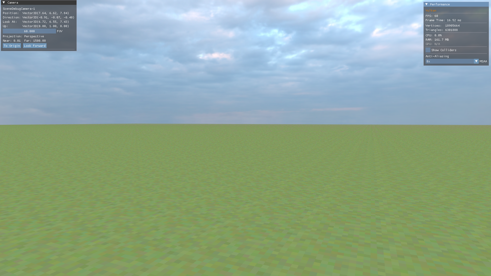

# SleakCraft

A voxel-based sandbox game built with [SleakEngine](https://github.com/CanReader/SleakEngine), featuring chunk-based terrain generation and block rendering with a texture atlas system.



## Features

- **Chunk-based world** — 16x16x16 chunks loaded/unloaded dynamically around the player
- **Block system** — Multiple block types (Grass, Dirt, Stone) with per-face texturing
- **Texture atlas** — Efficient single-texture rendering with tile-based UV mapping
- **Face culling** — Only visible faces between air and solid blocks are meshed
- **Dynamic render distance** — Configurable chunk loading radius
- **First-person camera** — Fly-mode exploration with configurable movement
- **Skybox** — Atmospheric sky rendering

## Tech Stack

- **Engine:** [SleakEngine](https://github.com/CanReader/SleakEngine) (Vulkan-based)
- **Language:** C++23
- **Build System:** CMake 3.31+
- **Shading:** Custom flat shader (GLSL / SPIR-V)

## Building

```bash
git clone --recursive https://github.com/CanReader/SleakCraft.git
cd SleakCraft
cmake --preset debug
cmake --build --preset debug
```

> **Already cloned without `--recursive`?**
> ```bash
> git submodule update --init --recursive --remote
> ```

### Run

```bash
./bin/SleakEngine -w 1280 -h 720 -t SleakCraft
```

| Flag | Description |
|------|-------------|
| `-w` | Window width |
| `-h` | Window height |
| `-t` | Window title |

## Project Structure

```
SleakCraft/
├── Engine/                  # SleakEngine submodule (Vulkan renderer, ECS, physics)
├── Game/
│   ├── assets/
│   │   ├── shaders/         # Flat shader (vert/frag + SPIR-V)
│   │   └── textures/        # Block texture atlas
│   ├── include/
│   │   ├── World/           # Block, Chunk, ChunkManager, TextureAtlas
│   │   └── MainScene.hpp
│   └── src/
│       ├── World/           # Chunk meshing and world management
│       └── MainScene.cpp
├── Client/                  # Application entry point
└── CMakeLists.txt
```

## License

This project is released under the [MIT License](LICENSE).
