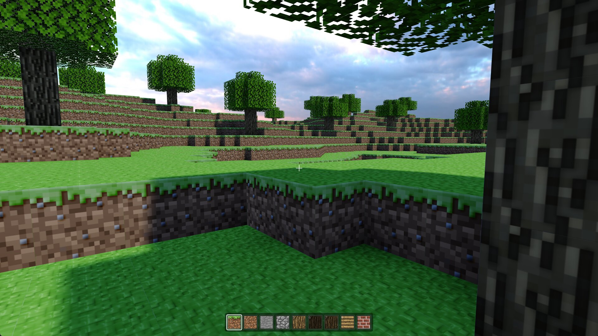
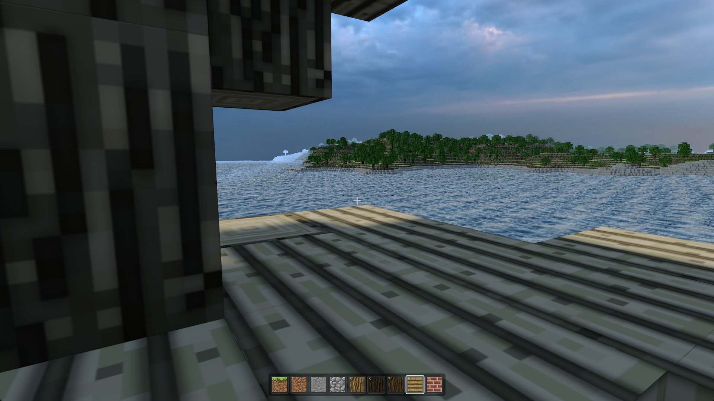

# SleakCraft

A voxel sandbox game built on [SleakEngine](https://github.com/CanReader/SleakEngine) — a custom C++ engine supporting DirectX 11, DirectX 12, Vulkan, and OpenGL.






## Features

### World
- **Chunk-based terrain** — 16×16×16 chunks dynamically loaded and unloaded around the player
- **Procedural generation** — Continental noise with oceans, coasts, rivers, lakes, beaches, and mountains
- **Biomes** — Plains, Forest, Desert, Mountains, Beach, Ocean — each with distinct terrain and vegetation
- **Water system** — Oceans, rivers, and lakes with realistic water rendering (Gerstner waves, Fresnel reflections, volumetric scattering)
- **Multi-threaded chunk loading** — Background worker threads stream and mesh chunks asynchronously; foreground sync on user interaction
- **Dynamic render distance** — Configurable at runtime via the settings panel or `-rd` CLI flag
- **Face culling** — Only visible faces (air↔solid boundaries) are meshed, keeping draw calls minimal
- **Transparent rendering** — Leaves and water rendered in separate alpha-blended passes

### Blocks
15 block types with per-face textures built into a runtime texture atlas:

| Block | Block | Block |
|-------|-------|-------|
| Grass | Dirt | Stone |
| Cobblestone | Sand | Gravel |
| Oak Log | Dark Oak Log | Spruce Log |
| Oak Planks | Bricks | Oak Leaves |
| Water | | |

### Gameplay
- **Block breaking** — Left-click with particle break effect
- **Block placing** — Right-click with placement animation; block appears after the animation completes
- **Hotbar** — 9 slots, cycle with scroll wheel or 1–9 keys
- **Physics** — Gravity, jumping, AABB collision resolution against voxel terrain
- **Fly mode** — Double-tap Space to toggle; Space/Ctrl to ascend/descend, Shift to sprint
- **Save / Load** — F5 to save, F6 to load; auto-save every 120 seconds when dirty; RLE-compressed binary format with CRC32 integrity
- **Multiple worlds** — Each world stored in its own `saves/<name>/` directory

### Graphics
- **Multi-API rendering** — DirectX 11, DirectX 12, Vulkan, OpenGL — switchable via `-r` flag
- **Shadows** — PCF shadow mapping with Poisson disk sampling, cave/interior shadow fix
- **Water rendering** — Gerstner wave displacement, Fresnel reflections, Beer-Lambert absorption, GGX specular highlights, subsurface scattering, caustics, foam
- **MSAA** — Up to 8× anti-aliasing (hardware-limited), configurable at runtime
- **Texture filtering** — Anisotropic (2×–16×), bilinear, trilinear with LOD bias control
- **Alpha blending** — Proper transparency for water and foliage across all backends
- **Skybox** — Atmospheric sky with fog that fades at the render distance boundary
- **Block outline** — Highlights the targeted block

### Performance & Benchmarking
- **Built-in benchmark recorder** — Toggle with F12 (Debug builds); auto-start with `--bench`
- **CSV output** — Per-frame: time, frame time (ms), FPS, triangle count, CPU %, RAM (MB)
- **Summary statistics** — Min/max/avg/stdev, P50/P95/P99 percentiles, spike counts (>16 ms, >33 ms, >50 ms), VSync/MSAA settings, hardware info (GPU, CPU, RAM, OS)
- **Visualizer** — `tools/benchmark_visualizer.py` — frame time over time with spike highlighting, histogram, system load plot

### HUD & Debug
- **F3 HUD** — Position, direction, FPS, frame time, triangles, CPU/RAM/GPU %, renderer label
- **Settings panel** — Live controls for VSync, MSAA, render distance, multithreaded loading, texture filtering, collider overlay

---

## Tech Stack

| Layer | Technology |
|-------|-----------|
| Engine | [SleakEngine](https://github.com/CanReader/SleakEngine) |
| Language | C++23 |
| Build | CMake 3.31+ |
| Graphics APIs | DirectX 11 · DirectX 12 · Vulkan · OpenGL |
| Shader languages | HLSL · GLSL · SPIR-V |

---

## Building

```bash
git clone --recursive https://github.com/CanReader/SleakCraft.git
cd SleakCraft
cmake --preset debug
cmake --build --preset debug
```

> **Cloned without `--recursive`?**
> ```bash
> git submodule update --init --recursive --remote
> ```

Binaries are output to `bin/`.

---

## Running

```bash
cd bin
./SleakCraft [OPTIONS]
```

### CLI Options

| Flag | Description |
|------|-------------|
| `-r <api>` | Renderer: `vulkan` · `d3d11` · `d3d12` · `opengl` |
| `-w <n>` | Window width (default: 1200) |
| `-h <n>` | Window height (default: 800) |
| `-t <name>` | Window title — use `_` for spaces |
| `--fullscreen` | Start in fullscreen |
| `-world <name>` | Load world if save exists, create new otherwise |
| `-seed <n>` | Seed for new world creation (default: random) |
| `-rd <n>` | Initial render distance in chunks (default: 8) |
| `-msaa <n>` | MSAA sample count: `1` · `2` · `4` · `8` |
| `--vsync` | Enable VSync on launch |
| `--no-vsync` | Disable VSync on launch |
| `--bench` | Auto-start benchmark recording on launch |
| `--help` | Show all options |

### Examples

```bash
# Open or create a world with Vulkan
SleakCraft -r vulkan -world MyWorld

# DirectX 12, specific seed, 16-chunk render distance, 4× MSAA
SleakCraft -r d3d12 -world Perf -seed 12345 -rd 16 -msaa 4

# Fullscreen at 1920×1080 with VSync
SleakCraft -w 1920 -h 1080 --fullscreen --vsync

# Run a benchmark session automatically and exit when done
SleakCraft -r vulkan -world BenchWorld --bench
```

---

## Controls

| Key / Button | Action |
|-------------|--------|
| W A S D | Move |
| Space | Jump |
| Space ×2 | Toggle fly mode |
| Space / Ctrl | Ascend / descend (fly) |
| Shift | Sprint |
| Mouse | Look |
| Scroll / 1–9 | Select hotbar slot |
| Left Click | Break block |
| Right Click | Place block |
| Escape | Return to main menu (saves world, stops benchmark) |
| F3 | Toggle HUD |
| F5 | Save world |
| F6 | Load world |
| F11 | Toggle fullscreen |
| F12 | Toggle benchmark recording *(Debug builds)* |

---

## Project Structure

```
SleakCraft/
├── Engine/                  # SleakEngine submodule
│   └── Engine/
│       ├── include/public/  # Public engine API (Application, CommandLine, …)
│       └── src/             # Renderer backends, ECS, physics, audio
├── Game/
│   ├── assets/
│   │   ├── shaders/         # HLSL/GLSL/SPIR-V shaders (flat, water)
│   │   └── textures/        # Block textures + runtime atlas, UI background
│   ├── include/
│   │   └── World/           # Block, Chunk, ChunkManager, SaveManager, …
│   └── src/
│       ├── World/           # Chunk meshing, world gen, save/load, block effects
│       ├── MainScene.cpp    # In-game scene (player, HUD, settings)
│       ├── MainMenuScene.cpp
│       └── Game.cpp         # Scene lifecycle, CLI world launch
├── Client/
│   └── src/main.cpp         # Entry point — registers CLI help, boots Application
├── tools/
│   └── benchmark_visualizer.py
└── CMakeLists.txt
```

---

## License

Released under the [MIT License](LICENSE).
